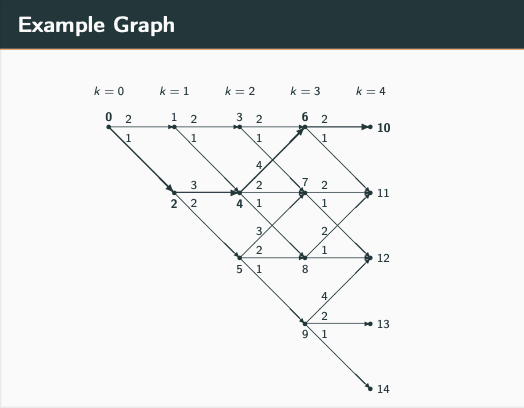

## Notation
- $s$ - a state
- $S$ - the set of all states, so for any $s \in S$ or for all $s \in S$ is is a statement the states in the state space. The symbol $\in$ is read "is an element of" or more simply said with the word "in".  
- $a$ - an action (also often called a decision)
- $A_s$ - the set of actions at state $s$.
- $r$, $r(s,a)$ the reward, or more explicitely the reward for taking action $a$ at state $s$
- $\pi$ - the policy, or decision making rule
- $\pi(s)$ - the action, or decision, to take at state $s$ using policy $\pi$
- $V_{\pi}(s)$ - the value of state $s$ when using policy $\pi$
- $Q_{\pi}(s,a)$ - the value of taking action $a$ at state $s$ using policy $\pi$

- $\gamma$ - discount factor for future rewards
- $\alpha$ - learning rate used in iterative algorithms
- $\epsilon$ - the probability of exploration used in selecting action in the $\epsilon$-greedy process

## Dynamic Programming
Consider the example graph in Figure 1. Here the states are represented by the intergers 0 through 14. So $S = \{0,1, \ldots, 14\}$. The actions are not explicity labeled. But let's say that the pair $(0,1)$ represents the action of going from state $0$ to state $1$. The set of actions at state 0, or $A_0$ is $\{(0,1), (0,2)\}$. The reward for taking action $(0,1)$ (at state 0) is $2$. The reward for taking action $(0,1)$ is $1$. The goal is to find a sequence of actions so as to maximize the sum of the reward when starting at initial state $0$ and ending at one of the terminal states, $\partial S = \{10,11,12,13,14\}$. The symbol $\partial$ can be read as "the boundary of", so $\partial S$ is the boundary of $S$, the state space. Here this is the set of terminal states from which no further action can be taken.

|     |     |
| --- | --- |
|   Figure 1 Example Graph |     |

A computationally efficient method for solving this problem is the dynamic programming algorithm. This algorithm uses the concept of Bellman value at a state. The value of a state is defined as the maximum reward that can be received starting at that state and then moving forward. 

### Dynamic Programming for the k=3 states and the terminal k=4 states
For instance, consider state $6$ in figure 1. There are two actions $(6,10)$ and $(6,11)$. The immediate reward for taking action $(6,10)$ is $2$ and the immediate reward for taking action $(6,11)$ is $1$. There is no future reward from states $10$ and $11$, so the value at those states is $0$. The value at state $6$ is then
$$
V(6) = \max \{2+V(10),1+V(11)\}
$$
But we just said that $V(10)=0$ and $V(11) = 0$. So
$$
\begin{align}
V(6) & = \max\{2,1\} \\
 & =  2
\end{align}
$$
That $V(6) = 2$ means that the maximum reward that can be received from state $6$ is $2$.

Following this procedure for states 7 and 8
$$
\begin{align}
V(7) & = \max\{2+V(11),1+V(12)\} \\
& = \max\{2,1\} \\
& = 2
\end{align}
$$
$$
\begin{align}
V(8) & = \max\{2+V(11),1+V(12)\} \\
& = \max\{2,1\} \\
& = 2
\end{align}
$$

and then for state 9
$$
\begin{align}
V(9) & = \max\{4+V(12),2+V(13), 1+V(14)\} \\
& = \max\{4,2,1\} \\
& = 4
\end{align}
$$
### Dynamic Programming for the k=2 states
Next consider state $3$. There are two actions, $(3,6)$ and $(3,7)$. State $3$'s value is
$$
V(3) = \max \{2+V(6), 1+V(7)\}
$$
States $6$ and $7$ have non zero values; $V(6)=2$ and $V(7) = 2$. So 
$$
\begin{align}
V(3) & = \max\{2+2,1+2\} \\
& = \max\{4,3\} \\
& = 4
\end{align}
$$
Similarly, for states 4 and 5
$$
\begin{align}
V(4) & = \max\{4+V(6), 2+V(7),1+V(8)\} \\
& = \max\{4+2,2+2,1+2\} \\
& = 6
\end{align}
$$
and
$$
\begin{align}
V(5) & = \max\{3+V(7), 2+V(8),1+V(9)\} \\
& = \max\{3+2,2+2,1+4\} \\
& = 5
\end{align}
$$
Note that at state 5 there are two decision result in the same value - (5,7) and (5,9).  

### Dynamic Programming for the k=1 states
For states 1 and 2
$$
\begin{align}
V(1) & = \max\{2+V(3),1+V(4)\} \\
& = \max\{2+4,1+6\} \\
& = 7
\end{align}
$$
and
$$
\begin{align}
V(2) & = \max\{3+V(4),2+V(5)\} \\
& = \max\{3+6,2+5\} \\
& = 9
\end{align}
$$
### Dynamic Programming for the k=0 initial state
And lastly for the initial state 0
$$
\begin{align}
V(0) & = \max\{2+V(1),1+V(2)\} \\
& = \max\{2+6,1+9\} \\
& = 10
\end{align}
$$
That $V(0)=10$ means that the path that accumulates the largest reward, starting with state $0$ and ending with a terminal states, has a total reward of $10$. The __argument__ of the of the maximization function is the decision to take to achieve the largest reward. This is written as
$$
\arg\max V(0) = (0,2)
$$
The collection of optimal decisions at each state is the __optimal policy__. A list of states, values, and decisions can be presented in a table, which is the so-called tabular solution to the dynamic programming problem associate with figure 1.

Table 1 Tabular solution to the optimal path problem from figure 1.

| State                                                                    | Value | Decision       |
| -----                                                                    | ----- | -------------- |
| 0                                                                        | 10    | (0,2)          |
| 1                                                                        | 7     | (1,4)          |
| 2                                                                        | 9     | (2,4)          |
| 3                                                                        | 4     | (3,6)          |
| 4                                                                        | 6     | (4,6)          |
| 5                                                                        | 5     | (5,7) or (5,9) |
| 6                                                                        | 2     | (6,10)         |
| 7                                                                        | 2     | (7,11)         |
| 8                                                                        | 2     | (8,11)         |
| 9                                                                        | 4     | (9,12)         |
| 10                                                                       | 0     |                |
| 11                                                                       | 0     |                |
| 12                                                                       | 0     |                |
| 13                                                                       | 0     |                |
| 14                                                                       | 0     |                |

Starting at state $0$, the optimal decision goes to state $2$. The optimal decision at state $2$ goes to state $4$. The optimal decision at state $4$ goes to state $6$. And the optimal decision at state $6$ goes to state $10$. So, the optimal path is $\{0,2,4,6,10\}$ with a total reward of $V(0) = 10$.

Examine the immediate rewards at state $0$. They are $2$ and $1$. Making the decision to not take the decision with the largest immediate reward results in a larger long term reward. Making the decision to take the largest immediate reward at each state is the myopic policy and may not be optimal in the long term, as in this example problem.

The value function does more than determining the optimal value and optimal policy. It specifies what the optimal value and policy are from any state, not just the initial state and states on the optimal trajectory.  

## The state-action value function or $Q$ function
The value function $V(s)$ returns the reward that can be received following the optimal path from a state, $s$, going forward.  A related function is the $Q$-function that maps state action pairs onto values. The $Q$-function takes as input both a state, $s$, and an action, $a$, and returns the value associated with that state, action pair.

Suppose upon taking action $a$ at state $s$, the system evolves to state $s'$. See figure 2 below. The $Q$ at state $s$ and  for action $a$ is
$$
Q(s,a) = r + V(s') \tag{1}
$$

At state $s$, the maximum of the $Q$ values for all $a \in A_s$ (all actions at that state) is the value of that state, $V(s)$. So
$$
V(s) = \max_{a \in A_s} Q(s,a) \tag{2}
$$
Then
$$
Q(s,a) = r + \max_{a' \in A_{s'}} Q(s',a') \tag{3}
$$
The policy function is the optimal decisions at the states
$$
\pi(s) = \arg \max_{a \in A_s} Q(s,a) \tag{4}
$$

To compute $Q$ values it helps to introduce the notional ideas of evolving from state $s$ to state $s'$ as a result of action $a$ as shown in figure 2.

|  |     |
| ---------------- | --- |
| Figure 2 Notional diagram for depicting the evolution from the state,$s$, to state, $s'$, resulting from action $a$.                 |     |

Consider the case when $s=0$ and $a=(0,1)$. Using the graph in figure 1, $s'=1$. The immediate reward for this action is $r=2$. From Table 1 $V(s') = V(1) = 7$. Substituting these values into Equation 1
$$
Q(s,a) = r + V(s')
$$
results in
$$
Q(0,(0,1)) = 2 + 7 = 9
$$

Similarly, 
$$
Q(0,(0,2)) = 1 + 9 = 10
$$

Performing similar calculation, the $Q$ table for the graph in figure 1 can be completed and is shown in Table 2 below.

Table 2 Computation of $Q$ values for the graph in figure 1

| $s$ | $a$    | $r_a$ | $s'$ | $V(s')$ | $Q(s,a)$ |
| --- | ------ | ----- | ---- |:-------:|:--------:|
| 0   | (0,1)  | 2     | 1    |    7    |    9     |
| 0   | (0,2)  | 1     | 2    |    9    |    10    |
| 1   | (1,3)  | 2     | 3    |    4    |    6     |
| 1   | (1,4)  | 1     | 4    |    6    |    7     |
| 2   | (2,4)  | 3     | 4    |    6    |    9     |
| 2   | (2,5)  | 2     | 5    |    5    |    7     |
| 3   | (3,6)  | 2     | 6    |    2    |    4     |
| 3   | (3,7)  | 1     | 7    |    2    |    3     |
| 4   | (4,6)  | 4     | 6    |    2    |    6     |
| 4   | (4,7)  | 2     | 7    |    2    |    4     |
| 4   | (4,8)  | 1     | 8    |    2    |    3     |
| 5   | (5,7)  | 3     | 7    |    2    |    5     |
| 5   | (5,8)  | 2     | 8    |    2    |    4     |
| 5   | (5,9)  | 1     | 9    |    4    |    5     |
| 6   | (6,10) | 2     | 10   |    0    |    2     |
| 6   | (6,11) | 1     | 11   |    0    |    1     |
| 7   | (7,11) | 2     | 11   |    0    |    2     |
| 7   | (7,12) | 1     | 12   |    0    |    1     |
| 8   | (8,11) | 2     | 11   |    0    |    2     |
| 8   | (8,12) | 1     | 12   |    0    |    1     |
| 9   | (9,12) | 4     | 12   |    0    |    4     |
| 9   | (9,13) | 2     | 13   |    0    |    2     |
| 9   | (9,14) | 1     | 14   |    0    |    1     |

## Developing a computational procedure
Equation 3 again is 
$$
Q(s,a) = r + \max_{a' \in A_{s'}} Q(s',a')
$$
This equation is in terms of only the states, actions, rewards, and $Q$ values associated with the state-action pairs. An iteration that starts with random (or perhaps 0) values for the Q values is
$$
Q(s,a) \leftarrow (1-\alpha) Q(s,a) + \alpha ( r + \gamma \max_{a'} Q(s',a')) \tag{5}
$$
where $\alpha \in (0,1)$ and $0<\gamma<1$. The parameter $\alpha$ is the learning rate that determines how quickly estimates of the $Q$ values change. The parameter $\gamma$ discounts future rewards in relation to current reward. One can show that equation 5 converge to a fixed point. That the fixed point is a solution follow from definitions of $Q$.

In cases where $Q$ values can be specified in a table (in computer memory) performing this iterative computation until convergence results in $Q$ values from which a policy function can be computed.

This computation can also be used to develop an iterative episodic approach to solving the reinforcement learning problem. Here, the iteration proceeds from an initial state and continues until a terminal state is encountered. $Q$-values for the states visited duing the episode are updated using Equation 5.  At each state the current estimate of the optimal decision is made with probability $(1-\epsilon)$ and a random decision is chosen among $A_s$ with probability $\epsilon$. 

### Approximate $Q$ values
In those cases where the $Q$ function cannot be held in a table in computer memory an approximation to the $Q$ function is used. Since 1989 it has been known that a neural network with as few as a single hidden layer is able to approximate a wide class of functions. See the Wikipedia article [here](https://en.wikipedia.org/wiki/Universal_approximation_theorem) for a brief history on the evolution of proofs of the function approximation capabilities of feed forward neural networks. More authoratative references are in the Wikipedia article.

This begs for application of a neural network approximation to the $Q$ in those cases where the $Q$ table cannot be held in computer memory. That is to say approximate $Q(s,a)$ with a neural network function $\tilde{Q}(s,a,\theta)$ that has neural network weights $\theta$.

$$
Q(s,a) \approx \tilde{Q}(s,a,\theta) \tag{6}
$$
This approximation can then be used in the iterative $Q$ update algorithm 
$$
\tilde{Q}(s,a,\theta) \leftarrow (1-\alpha) \tilde{Q}(s,a,\theta) + \alpha ( r + \gamma \max_{a'} \tilde{Q}(s',a',\theta)) \tag{7}
$$
The resulting approximation to the $Q$ function can then be used to compute a policy yielding a decision function that returns the action to take at each state.

The algorithm implied from Equation 7 is computationally problematic. In the algorithm resulting from Equation 5 the Q values for the problem are learned through an iteration that converges. In equation 7 the same iteration occurs, however the approximation to the Q function also must be learned. Said otherwise, $Q$ values are being learned with a model of the $Q$ values that is changing itself.

